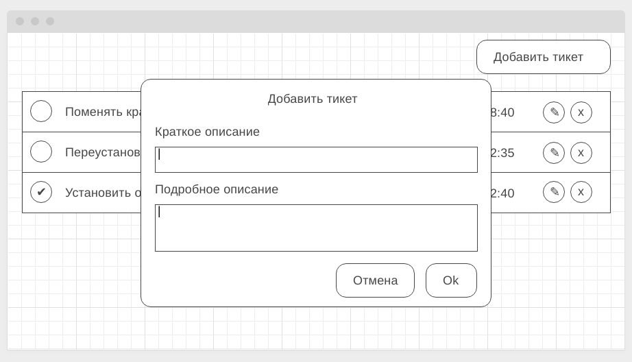

# Домашнее задание к занятию "7. Работа с HTTP"

Правила сдачи задания:

1. **Важно**: в рамках этого ДЗ нужно использовать npm (а значит, никакого `yarn.lock` в репозитории быть не должно)
1. Frontend должен собираться через Webpack (включая картинки и стили) и выкладываться на Github Pages через Appveyor
1. В README.md должен быть размещён бейджик сборки и ссылка на Github Pages
1. В качестве результата присылайте проверяющему ссылки на ваши GitHub-проекты
1. Авто-тесты писать не требуется

**Важно**: в данном ДЗ вам потребуется выполнить мини-проект. Мы понимаем, что он может занять чуть больше времени, чем обычные ДЗ, но тема HTTP настолько важна, что стоит уделить этому чуть больше времени.

---

## HelpDesk: Frontend

### Легенда

API вами написано, пора приступить к своим прямым обязанностям - написанию фронтенда, который будет с этим API работать.

#### Описание

Общий вид списка тикетов (должны загружаться с сервера в формате JSON):

Модальное окно добавления нового тикета (вызывается по кнопке "Добавить тикет" в правом верхнем углу):

Модальное окно редактирования существующего тикета (вызвается по кнопке с иконкой "✎" - карандашик):

Модальное окно подтверждения удаления (вызывается по кнопке с иконкой "x" - крестик):

Для просмотра деталей тикета нужно нажать на самом тикете (но не на контролах - сделано, редактировать или удалить):

В качестве бонуса можете отображать какую-нибудь иконку загрузки (см. <https://loading.io>) на время подгрузки.

Авто-тесты к данной задаче не требуются. Все данные и изменения должны браться/сохраняться на сервере, который вы написали в предыдущей задаче.

В качестве результата пришлите проверяющему ссылку на GitHub репозиторий.

P.S. Подгрузка подробного описания специально организована в виде отдельного запроса, мы прекрасно понимаем, что на малых объёмах информации нет смысла делать её отдельно.
