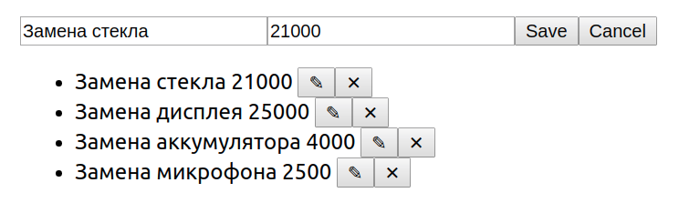

# Редактирование и фильтрация

## 1. Редактирование

Этот проект не предполагает взаимодействия по протоколу HTTP и наличия серверной части.

Взяв за основу проект, рассмотренный на лекции, доработайте его либо напишите с нуля:

1. По умолчанию показывается форма добавления, при заполнении и нажатии на кнопку Save происходит добавление элемента в список:

1. При нажатии на кнопку «Редактировать» форма автоматически заполняется данными элемента:

Далее возможны два сценария:

2.1 Если пользователь нажал на кнопку Save, запись в таблице обновляется.

2.2 Если пользователь нажал на кнопку Cancel, то поля вычищаются и снова отображается форма добавления.

Бонусное задание: подумайте, как должно вести себя приложение, если вы при редактировании записи, нажмёте на «Удалить» — крестик.

## 2. Фильтрация

Предложите вариант реализации возможности фильтрации: то есть у вас должно быть строковое поле, при введении данных в которое будут отображаться только объекты, у которых название содержит введённую строку.

Предложите собственную реализацию этой функциональности.

Обратите внимание:

1. При пустом значении фильтра должны показываться все объекты.
1. Неважно, заполнен фильтр или нет, все функции редактирования — добавление, обновление, удаление — должны быть доступны.

Напоминаем, что фильтр — это просто текстовое поле.

**Важно**: попробуйте проанализировать существующие системы на предмет того, как это реализовано у них, и на базе этого предложить собственное решение.
